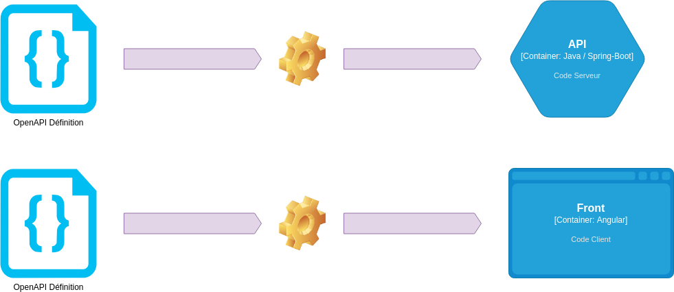

:classification: C0 - Public
:source-highlighter: pygments
:sectanchors:
:sectlinks:
:customcss: style/prez.css
:version: 1.0

[background-image=style/title-bg.png, state=title]
== AsyncAPI 

Comment appliquer les principes Design First à l'Event Driven Architecture

[background-image=style/background/demarche.jpg, transition=none]
== Démarche API

[%step]
image:style/demarche-api-gbl.png[]

image:style/img-space.png[height=150]

[.notes]
--
Depuis 2020 j'essaye de promouvoir une démarche pour la mise en place d'APIs REST.

Cela part de la définition de standard, jusqu'à l'observabilité et le monitoring, en passant par l'architecture, les bonnes pratiques de développement et...
--

[background-image=style/background/demarche.jpg, transition=none]
== Démarche API

image:style/demarche-api-dsg.png[]

image:style/img-space.png[height=150]

[.notes]
--
Ce qui nous intéresse aujourd'hui L'approche Design First...

L'objectif de cette présentation est de voir comment reprendre le principe de Design First pour les APIs dans le monde de l'Event Driven Architecture (EDA)
--

[background-image=style/background/openapi.jpg, transition=none]
== OpenAPI

image:style/img-space.png[height=15]

[%step]
http://spec.openapis.org/oas/v3.1.0[http://spec.openapis.org/oas/v3.1.0]

[%step]
image:style/openapi-design.png[height=100]

[%step]
https://openapi.tools/[https://openapi.tools/]

[%step]

image:style/img-space.png[height=150]

[.notes]
--
Dans l'univers des API REST la fondation OpenAPI propose, une spécification permettant de designer des APIs.

Mais également divers outils donc openapi-generator, permettant de générer le code côté serveur, mais également côté client.
--

[background-image=style/background/generate.jpg, transition=none]
== Code Generation

[%step]

image:style/img-space.png[height=150]

[.notes]
--
Côté serveur par exemple, l'outil va générer : 

* L'interface et l'implémentation exposant l'API
* Les DTOs : Les objets de requêtes et réponses
* Et une interface délégate 

Le développeur lui n'à plus qu'à implémenter :

* Le delegate en s'appuyant sur le Domaine Métier
* Et le mappeur Objet Métier / DTO 
--

[background-image=style/background/talk.jpg, transition=none]
== Mon Talk OpenAPI

[%step]
https://github.com/darken33/api-design-first[API Design First : Boostez le développement de vos APIs]

[%step]

[%step]
https://www.youtube.com/watch?v=DIuCVGkG9HA[La vidéo youtube]

image:style/img-space.png[height=150]

[background-image=style/background/eda.jpg, transition=none]
== Event Driven Architecture

[%step]

image:style/img-space.png[height=150]

[.notes]
--
L’event driven est le fait qu’une application va émettre un message dans un bus d'évènement,
Une application qui écoute se bus, pourra alors déclencher un traitement à réception de ce dernier.

Des "services bus" connus : 

* RabbitMQ
* Kafka
* ...

Ne pourrait on pas définir un "contrat d'interface" décrivant ce message, afin de sassurer que le producer et le consumer on le même niveau de compréhension ?
--

[background-image=style/background/standard.jpg, transition=none]
== AsyncAPI

[%step]

[%step]
https://www.asyncapi.com/[https://www.asyncapi.com/]

image:style/img-space.png[height=150]

[.notes]
--
AsyncAPI est une initiative open source créée en 2017 par Fran Méndez pour relever les défis posés par les architectures événementielles (Swagger date de 2011).

Cette initiative propose :

* Une spécifiaction pour l'EDA
* Des outils de génration pour la documentation
* Des outils de génération de code (TypeScript, Java, C#, ...)
* Une large communauté
* La garantie d'une gouvernance ouverte grâce à la Linux Foundation
* Et d'autres idées et outils au travers de leur github
--

[background-image=style/background/standard.jpg, transition=none]
== OpenAPI vs AsyncAPI

[%step]

image:style/img-space.png[height=150]

[.notes]
--
La spécification AsyncAPI est basée sur OpenAPI, ce qui fait que si vous designez vous API REST en suivant cette spéfication,
Le passage à AsyncAPI ne devrait pas être très compliqué.

Il est à noter que AsyncAPI se veut agnostique du protocole de communication et doit pouvoir adresser n'importe quel protocole tels que AMQP, MQTT, WebSockets, Kafka, HTTP, ...
--

[background-image=style/background/design-first.jpg, transition=none]
== Définir son API

image:style/img-space.png[height=5]

[%step]
[.text-left]
* LE SERVEUR
* LE CHANNEL
* LE PRODUCER
* LE CONSUMER
* LA SÉCURITÉ
* LE MESSAGE
* LA DOCUMENTATION

[%step]
https://studio.asyncapi.com/[https://studio.asyncapi.com/]

image:style/img-space.png[height=150]

[.notes]
--
Comme pour OpenAPI nous alons donc commencer par designer une API Asynchrone : un simple Hello World.

AsyncAPI propose l'outil studio.asyncapi, mais il existe également des plugins IDE (comme pour VSCode).
--

[background-image=style/background/demo.jpg, transition=none]
== Démo

image:style/img-space.png[height=800]

[background-image=style/background/generate-tools.jpg, transition=none]
== Génération Tools

[%step]
[.text-left]
* https://github.com/asyncapi/html-template[HTML TEMPLATE]
* https://github.com/asyncapi/asyncapi-react[REACT TEMPLATE]
* https://github.com/asyncapi/java-spring-template[SPRING TEMPLATE]
* https://github.com/asyncapi/nodejs-template[NODEJS TEMPLATE]
* https://github.com/asyncapi/php-template[PHP TEMPLATE]
* Autres...

image:style/img-space.png[height=15]

[%step]
[source,bash]
----
ag /home/pbousquet/Workspaces/SQLI/talks/asyncapi-design-first/demo/asyncapi-2/hello-asyncapi.yaml \
   @asyncapi/html-template \
   -p singleFile=true \
   -p outFilename=doc-hello-asyncapi.html
----

image:style/img-space.png[height=150]

[.notes]
--
AsyncAPI propose un grand nombre d'outils pour de la génération soit documentaire, soit de code.

L'exemple présenté ici permet notamment de générer une documentation HTML à parti de la spécification AsyncAPI.

À noter que les outils de génération de code permettent de générer des applications complètes, alors que nous recherchons plus un outil comme le plugin maven openapi-generator qui permet de s'intégrer dans un projet existant.

----
ag /home/pbousquet/Workspaces/SQLI/talks/asyncapi-design-first/demo/asyncapi-2/hello-asyncapi.yaml \
   @asyncapi/java-spring-template \
   -p maven=true \
   -p javaPackage=com.sqli.pbousquet.hello.asyncapi \
   -p springBoot2=true
----
--

[background-image=style/background/demo.jpg, transition=none]
== Démo

image:style/img-space.png[height=800]

[background-image=style/background/zenwave-sdk.jpg, transition=none]
== ZenWave SDK

[%step]
[.text-left]
* Accélérer le developpement API

[%step]
image:style/zenwave.png[height=400]

[%step]
https://zenwave360.github.io/[https://zenwave360.github.io/]

image:style/img-space.png[height=150]

[.notes]
--
Iván García Sainz-Aja développe de son coté un SDK proposant diverses chose :

* API First (OpenAPI, Async API)
* DDD (à partir d'un DSL)
* API Testing
* ...

Et notemment deux plugins maven : https://zenwave360.github.io/zenwave-sdk/zenwave-sdk-maven-plugin/

* générer les DTOs depuis une spécification AsyncAPI
* générer le code producer/consumer basé sur spring-cloud-streams (compatible notamment Kafka et RabbitMQ)
--

[background-image=style/background/generate.jpg, transition=none]
== Generation DTOs

[%step]
[source,xml]
----
<plugin>
  <groupId>io.github.zenwave360.zenwave-sdk</groupId>
  <artifactId>zenwave-sdk-maven-plugin</artifactId>
  <version>${zenwave.version}</version>
  <executions>
    <execution>
      <id>generate-asyncapi-producer-dtos</id>
      <phase>generate-sources</phase>
      <goals>
        <goal>generate</goal>
      </goals>
      <configuration>
        <generatorName>jsonschema2pojo</generatorName>
        <inputSpec>..../hello-asyncapi.yaml</inputSpec>
        <targetFolder>${project.build.directory}/generated-sources</targetFolder>
        <configOptions>
          <modelPackage>com.sqli.pbousquet.hello.model</modelPackage>
          <jsonschema2pojo.includeJsr303Annotations>true</jsonschema2pojo.includeJsr303Annotations>
          <jsonschema2pojo.isUseJakartaValidation>true</jsonschema2pojo.isUseJakartaValidation>
        </configOptions>
      </configuration>
    </execution>
  </executions>
</plugin>            
----

[%step]
[.text-left]
* modelPackage : package pour le DTO
* isUseJakartaValidation : pour Java 17+ / Spring Boot 3

image:style/img-space.png[height=150]

[background-image=style/background/generate.jpg, transition=none]
== Le Producer

[%step]
[source,xml]
----
<plugin>
  <groupId>io.github.zenwave360.zenwave-sdk</groupId>
  <artifactId>zenwave-sdk-maven-plugin</artifactId>
  <version>${zenwave.version}</version>
  <executions>
    <execution>
      <id>generate-asyncapi-producer</id>
      <phase>generate-sources</phase>
      <goals>
        <goal>generate</goal>
      </goals>
      <configuration>
        <generatorName>spring-cloud-streams3</generatorName>
        <inputSpec>..../hello-asyncapi.yaml</inputSpec>
        <targetFolder>${project.build.directory}/generated-sources</targetFolder>
        <configOptions>
          <operationIds>sendHelloMessage</operationIds>
          <apiPackage>com.sqli.pbousquet.hello.producer</apiPackage>
          <modelPackage>com.sqli.pbousquet.hello.model</modelPackage>
        </configOptions>
      </configuration>
    </execution>
  </executions>
</plugin>            
----

[%step]
[.text-left]
* apiPackage : package pour le code
* modelPackage : package du DTO
* operationIds : operations à générer

image:style/img-space.png[height=150]

[background-image=style/background/generate.jpg, transition=none]
== Code Généré

[%step]

[%step]
[.text-left]
* L'interface et l'implémentation de production
* Le DTO : la structure du message

image:style/img-space.png[height=150]

[.notes]
--
Ici il génère : 

* L'interface et l'implémentation de production
* Le DTO : la structure du message
--

[background-image=style/background/slide_implement.jpg, transition=none]
== Implémenter

image:style/img-space.png[height=30]

[%step]
[source,java]
----
package com.sqli.pbousquet.hello.service;

import org.springframework.beans.factory.annotation.Autowired;
import org.springframework.scheduling.annotation.Scheduled;
import org.springframework.stereotype.Component;
import com.sqli.pbousquet.hello.producer.IDefaultServiceEventsProducer;
import com.sqli.pbousquet.hello.model.HelloMessagePayload;
@Component
public class HelloService {
    
    @Autowired
    IDefaultServiceEventsProducer service;

    @Scheduled(fixedRate = 5000)
    public void sendHelloMessage() {
        HelloMessagePayload helloMessage = new HelloMessagePayload();
        helloMessage.setMessage("Hello fifi");
        service.sendHelloMessage(helloMessage, null);
    }
}
----

image:style/img-space.png[height=150]

[.notes]
--
Le développeur lui n'a plus qu'à implémenter :

* L'adapter faisant l'appel à la couche technique
* Éventuellement un mappeur Objet Métier / DTO 
--

[background-image=style/background/demo.jpg, transition=none]
== Démo

image:style/img-space.png[height=800]

[background-image=style/background/zenwave-sdk.jpg, transition=none]
== Le Consumer

[%step]
[source,xml]
----
<plugin>
  <groupId>io.github.zenwave360.zenwave-sdk</groupId>
  <artifactId>zenwave-sdk-maven-plugin</artifactId>
  <version>${zenwave.version}</version>
  <executions>
    <execution>
      <id>generate-asyncapi-receiveir</id>
      <phase>generate-sources</phase>
      <goals>
        <goal>generate</goal>
      </goals>
      <configuration>
        <generatorName>spring-cloud-streams3</generatorName>
        <inputSpec>..../hello-asyncapi.yaml</inputSpec>
        <targetFolder>${project.build.directory}/generated-sources</targetFolder>
        <configOptions>
          <operationIds>readHelloMessage</operationIds>
          <apiPackage>com.sqli.pbousquet.hello.receiver</apiPackage>
          <modelPackage>com.sqli.pbousquet.hello.model</modelPackage>
        </configOptions>
      </configuration>
    </execution>
  </executions>
</plugin>            
----

[%step]
[.text-left]
* apiPackage : package pour le code
* modelPackage : package du DTO
* operationIds : operations à générer

image:style/img-space.png[height=150]

[background-image=style/background/generate.jpg, transition=none]
== Code Généré

[%step]

[%step]
[.text-left]
* L'interface et l'implémentation de production
* Le DTO : la structure du message

image:style/img-space.png[height=150]

[.notes]
--
Ici il génère : 

* L'interface et l'implémentation de production
* Le DTO : la structure du message
--

[background-image=style/background/slide_implement.jpg, transition=none]
== Implémenter

image:style/img-space.png[height=50]

[%step]
[source,java]
----
package com.sqli.pbousquet.hello.service;

import org.springframework.stereotype.Component;
import com.sqli.pbousquet.hello.model.HelloMessagePayload;
import com.sqli.pbousquet.hello.receiver.IReadHelloMessageConsumerService;
@Component
public class HelloService implements IReadHelloMessageConsumerService {
    
    @Override
    public void readHelloMessage(HelloMessagePayload payload, HelloMessagePayloadHeaders headers) {
        System.out.println(payload.getMessage());
    }

}
----

image:style/img-space.png[height=150]

[.notes]
--
Le développeur lui n'a plus qu'à implémenter :

* L'implémentation du délegate 
* Éventuellement un mappeur DTO / Objet Métier 
--

[background-image=style/background/demo.jpg, transition=none]
== Démo

image:style/img-space.png[height=800]

[background-image=style/background/standard.jpg, transition=none]
== AsyncAPI v3.0

[%step]

image:style/img-space.png[height=150]

[.notes]
--
Le 6 décembre 2023, lors des API Days de Paris, l'annonce est faite que la version 3.0 de AsyncAPI vient de sortir.

Les deux évolutions majeures : 
* Découplage de chanels et opération (renommées en send et receive) pour plus de clarté
* Le fait de pouvoir utiliser des références (même externes) à tous les niveaux

Cependant les divers essais, que j'ai pu effectuer, me laissent à penser que l'outillage proposé par l'Initiative ne surportent pas encore la version 3.0

Par contre ZenWave SDK lui supporte cet version.

Il est donc préférable d'attendre encore un peu avant de migrer en v3.0
--

[background-image=style/background/demo.jpg, transition=none]
== Démo

image:style/img-space.png[height=800]

[background-image=style/background/zenwave-sdk.jpg, transition=none]
== Autres Outils

[%step]
[.text-left]
* https://www.asyncapi.com/tools/modelina[MODELINA] : DTO Generation
* https://www.asyncapi.com/tools/cli[AsyncApi CLI] : CLI pour céer ou valider
* https://github.com/orgs/asyncapi/discussions[Discussions] : Forum de la communauté
* https://microcks.io/documentation/using/asyncapi/[MICROKS] : Mock server 
* https://www.eventcatalog.dev/[EventCatalog] : Cataloguer vos APIs Async
* https://www.gravitee.io/[Gravitee.io] : APIM supportant AsyncAPI

image:style/img-space.png[height=300]

[background-image=style/background/conclusion.jpg, transition=none]
== Pour conclure

image:style/img-space.png[height=50]

[%step]
[.text-left]
* ASYNCAPI ET OPENAPI
* IMPLÉMENTER PLUS EFFICACEMENT VOS APIS
* INTÉGRER PLUS FACILEMENT LES APPELS À VOS APIS
* DOCUMENTATION EN ADÉQUATION AVEC L'IMPLÉMENTATION RÉELLE

image:style/img-space.png[height=200]

[background-image=style/background/thanks.jpg, transition=none]
== Merci

image:style/img-space.png[height=30]

[%step]

[%step]
https://github.com/darken33/asyncapi-design-first[Retrouvez la présentation ici]

[%step]

image:style/img-space.png[height=150]

